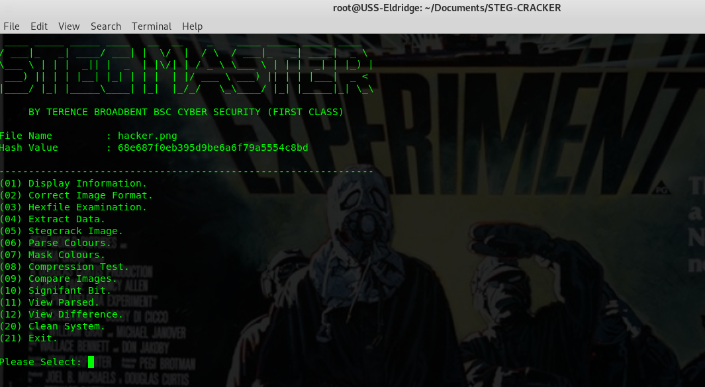

# STEG MASTER

| LANGUAGE | FILENAME | COMMAND |
|--------|----|-----|
| python | steg-cracker.py | picture.jpg|
| MD5 Hash - 01245f8b1d81936d7d1c6d30cb506f52 ||

- [ ] Significant Bit - Still under development.

Python script file to **decrypt** hidden data stored within images, contains a range of tools useful in the black art of steganography.

## CONSOLE DISPLAY
 

