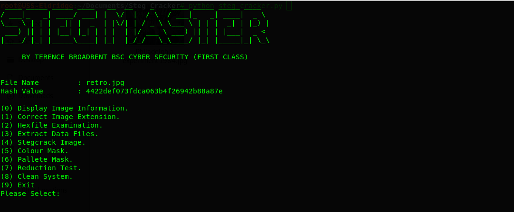

# Project-Stegmaster

python steg-cracker.py picture.jpg

Python script file bundle to decrypt hidden data stored in images. 

Contains a range of tools used in the black art of steganography, tools can be used seperately or via the master control menu.

 

