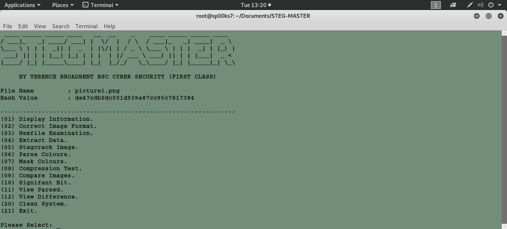

# STEG MASTER
## A PYTHON SCRIPT FILE TO FORENSICALLY INVESTIGATE AND EXTRACT HIDDEN DATA COVERTLY EMBEDDED WITHIN AN IMAGE.

Usage: python steg-cracker.py image.jpg

| LANGUAGE  | FILENAME        | MD5 HASH                         | CONTENTS               |
|--------   |----             |-----                             | ----                   |
| python    | StegMaster.py   | 110163e2b1417986d66eb46ab5072682 |                        |
| python    | mask-1.py       | 3b05dffb03909d9390f5016862ddc5e7 |                        |
| python    | mask-2.py       | f01ae7c9eb15d330ce59737661315493 |                        |
| text file | directories.txt | a0c57d049c5c9e5def378559a4ca4539 |                        |

    [+] Programming stage.
    [-] Testing stage.

A python script file to **decrypt** hidden data stored within images, contains a range of tools useful in the black art of Steganography.

### CONSOLE DISPLAY
 

