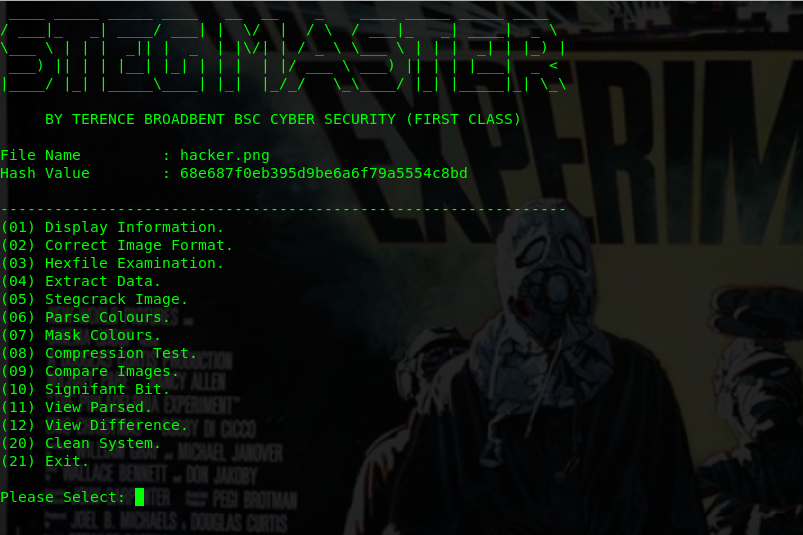

# PROJECT STEG-MASTER

|LANGUAGE|FILENAME|IMAGE|
|--------|----|-----|
|python|steg-cracker.py|picture.jpg

|c1a01b3e2cd3e2bd669edcd503fa45fc - MD5|

Python script file bundle to decrypt hidden data stored in images. 

Contains a range of tools used in the black art of steganography, tools that can be used seperately or via the master control program.

## CONSOLE DISPLAY
 

